<!DOCTYPE html>
<html lang="ptr-br">
<head>
    <meta charset="UTF-8">
    <meta http-equiv="X-UA-Compatible" content="IE=edge">
    <meta name="viewport" content="width=device-width, initial-scale=1.0">
    <link rel="shortcut icon" href="assets/img/favicon.ico" type="image/x-icon">
    <link rel="stylesheet" href="assets/css/index.css">
</head>
<body>
    

        

            <h1></h1>
            
        

        

            

        

    

</body>
</html>
